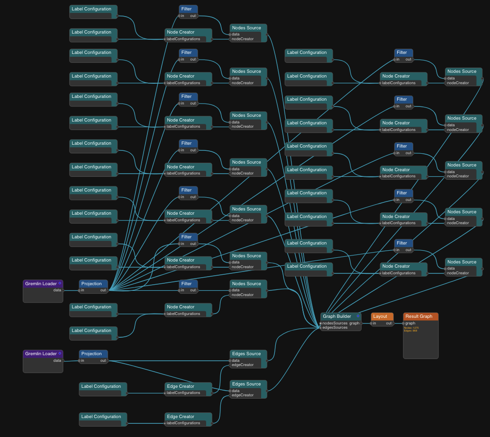
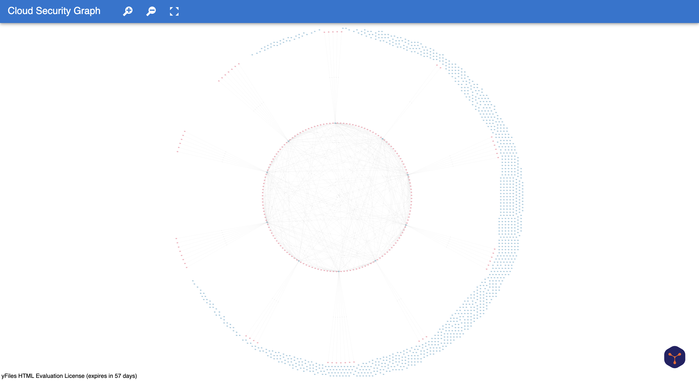

# From Complex Graphs to Clear Decisions: PuppyGraph + yWorks
At its core, PuppyGraph is designed to handle complex relationships between data points. But raw data, *especially* when it’s deeply interconnected, can be hard to understand at a glance. That’s where data visualization steps in.

While PuppyGraph comes with its own built-in UI for exploring graph data, its design focuses on simplicity and ease of use rather than deep customization. For teams or projects that require more advanced visualization features — like tailored layouts, interactive styling, or specialized graph diagrams — pairing PuppyGraph with dedicated visualization tools can enhance both clarity and flexibility. This combination lets you tap into PuppyGraph’s powerful querying engine while leveraging visualization platforms to craft the exact view your data story needs.

That’s where yWorks really starts to shine. With the right tools, it’s much easier to make sense of dense relationships, uncover hidden patterns, and communicate insights clearly. 

For this tutorial, we’re using building a **cloud security graph** — and that’s no coincidence. Cloud security is one of the most common and impactful use cases for graph analytics. With complex relationships between users, roles, assets, permissions, and threats, it's a perfect real-world example of where graph structures truly shine. You can find all required resources in the [GitHub repository](https://github.com/puppygraph/puppygraph-getting-started/tree/main/use-case-demos/cloud-security-graph-demo), and a more in-depth exploration of this dataset in our [blog](https://www.puppygraph.com/blog/wiz-security-graph).


# Step 1: Deploying PuppyGraph

### Setting up the Docker
We'll need several things for this tutorial:
- Docker and Docker Compose
- Python 3
- [Cloud Security Dataset](https://github.com/puppygraph/puppygraph-getting-started/tree/main/use-case-demos/cloud-security-graph-demo)

PuppyGraph can be deployed via [Docker or an AWS AMI](https://docs.puppygraph.com/getting-started/) through AWS Marketplace. We'll be launching a PuppyGraph instance on Docker for this demo.

After cloning the repository onto your local machine, you can navigate there and run `docker compose up -d` to launch the container and other services. You should see the following appear on your terminal:
```
[+] Running 6/6
✔ Network puppy-iceberg         Created
✔ Container minio               Started
✔ Container mc                  Started
✔ Container iceberg-rest        Started
✔ Container spark-iceberg       Started
✔ Container puppygraph          Started
```

You can open your browser and go to your instance's URL to access PuppyGraph's login screen. By default, this is `localhost:8081`. Log in using the default credentials:
```
username: puppygraph
password: puppygraph123
```

Once we get the data loaded, we'll return to this screen to set up the schema (the blueprint for how the data is organized).

### Data Preparation
We will first convert our csv data to into Paraquet format via the python script. The Paraquet format is designed for efficient data storage and retrieval, making it perfect for graph querying.

To keep the demonstration self-contained, we recommend creating a virtual environment to activate and install the necessary packages.
```
python3 -m venv demo_venv
source demo_venv/bin/activate
pip install pandas pyarrow
```

We can then run the following command in the repository:
```
python3 CsvToParquet.py ./csv_data ./parquet_data
```

### Data Import
Now that we have our data in the desired file format, we can begin to populate our Iceberg tables. First, start the Spark-SQL shell:
```
docker exec -it spark-iceberg spark-sql
```

You should see the following shell prompt:
```
spark-sql ()>
```

<details>
<summary>SQL Commands to Create Tables</summary>

```CREATE DATABASE security_graph;

CREATE EXTERNAL TABLE security_graph.Users (
  user_id               BIGINT,
  username              STRING,
  email                 STRING,
  phone                 STRING,
  created_at            TIMESTAMP,
  last_login            TIMESTAMP,
  account_status        STRING,
  authentication_method STRING,
  failed_login_attempts INT
) USING iceberg;

CREATE EXTERNAL TABLE security_graph.InternetGateways (
  internet_gateway_id   BIGINT,
  name                  STRING,
  region                STRING,
  status                STRING
) USING iceberg;

CREATE EXTERNAL TABLE security_graph.UserInternetGatewayAccess (
  user_id               BIGINT,
  internet_gateway_id   BIGINT,
  access_level          STRING,
  granted_at            TIMESTAMP,
  expires_at            TIMESTAMP,
  last_accessed_at      TIMESTAMP
) USING iceberg;

CREATE EXTERNAL TABLE security_graph.UserInternetGatewayAccessLog (
  log_id                BIGINT,
  user_id               BIGINT,
  internet_gateway_id   BIGINT,
  access_time           TIMESTAMP
) USING iceberg;

CREATE EXTERNAL TABLE security_graph.VPCs (
  vpc_id BIGINT,
  name STRING
) USING iceberg;

CREATE EXTERNAL TABLE security_graph.InternetGatewayVPC (
  internet_gateway_id BIGINT,
  vpc_id BIGINT
) USING iceberg;

CREATE EXTERNAL TABLE security_graph.Subnets (
  subnet_id BIGINT,
  vpc_id BIGINT,
  name STRING
) USING iceberg;

CREATE EXTERNAL TABLE security_graph.SecurityGroups (
  security_group_id BIGINT,
  name STRING
) USING iceberg;

CREATE EXTERNAL TABLE security_graph.SubnetSecurityGroup (
  subnet_id BIGINT,
  security_group_id BIGINT
) USING iceberg;

CREATE EXTERNAL TABLE security_graph.NetworkInterfaces (
  network_interface_id BIGINT,
  subnet_id BIGINT,
  security_group_id BIGINT,
  name STRING
) USING iceberg;

CREATE EXTERNAL TABLE security_graph.VMInstances (
  vm_instance_id BIGINT,
  network_interface_id BIGINT,
  role_id BIGINT,
  name STRING
) USING iceberg;

CREATE EXTERNAL TABLE security_graph.Roles (
  role_id BIGINT,
  name STRING
) USING iceberg;

CREATE EXTERNAL TABLE security_graph.Resources (
  resource_id BIGINT,
  name STRING
) USING iceberg;

CREATE EXTERNAL TABLE security_graph.RoleResourceAccess (
  role_id BIGINT,
  resource_id BIGINT
) USING iceberg;

CREATE EXTERNAL TABLE security_graph.PublicIPs (
  public_ip_id BIGINT,
  ip_address STRING,
  network_interface_id BIGINT
) USING iceberg;

CREATE EXTERNAL TABLE security_graph.PrivateIPs (
  private_ip_id BIGINT,
  ip_address STRING,
  network_interface_id BIGINT
) USING iceberg;

CREATE EXTERNAL TABLE security_graph.IngressRules (
  ingress_rule_id BIGINT,
  security_group_id BIGINT,
  protocol STRING,
  port_range STRING,
  source STRING
) USING iceberg;

CREATE EXTERNAL TABLE security_graph.IngressRuleInternetGateway (
  ingress_rule_id BIGINT,
  internet_gateway_id BIGINT
) USING iceberg;

INSERT INTO security_graph.Users
SELECT
    user_id,
    username,
    email,
    phone,
    CAST(created_at AS TIMESTAMP),
    CAST(last_login AS TIMESTAMP),
    account_status,
    authentication_method,
    failed_login_attempts
FROM parquet.`/parquet_data/Users.parquet`;

INSERT INTO security_graph.InternetGateways
SELECT * FROM parquet.`/parquet_data/InternetGateways.parquet`;

INSERT INTO security_graph.UserInternetGatewayAccess
SELECT
    user_id,
    internet_gateway_id,
    access_level,
    CAST(granted_at AS TIMESTAMP),
    CAST(expires_at AS TIMESTAMP),
    CAST(last_accessed_at AS TIMESTAMP)
FROM parquet.`/parquet_data/UserInternetGatewayAccess.parquet`;

INSERT INTO security_graph.UserInternetGatewayAccessLog
SELECT
    log_id,
    user_id,
    internet_gateway_id,
    CAST(access_time AS TIMESTAMP)
FROM parquet.`/parquet_data/UserInternetGatewayAccessLog.parquet`;

INSERT INTO security_graph.VPCs
SELECT * FROM parquet.`/parquet_data/VPCs.parquet`;

INSERT INTO security_graph.InternetGatewayVPC
SELECT * FROM parquet.`/parquet_data/InternetGatewayVPC.parquet`;

INSERT INTO security_graph.Subnets
SELECT * FROM parquet.`/parquet_data/Subnets.parquet`;

INSERT INTO security_graph.SecurityGroups
SELECT * FROM parquet.`/parquet_data/SecurityGroups.parquet`;

INSERT INTO security_graph.SubnetSecurityGroup
SELECT * FROM parquet.`/parquet_data/SubnetSecurityGroup.parquet`;

INSERT INTO security_graph.NetworkInterfaces
SELECT * FROM parquet.`/parquet_data/NetworkInterfaces.parquet`;

INSERT INTO security_graph.VMInstances
SELECT * FROM parquet.`/parquet_data/VMInstances.parquet`;

INSERT INTO security_graph.Roles
SELECT * FROM parquet.`/parquet_data/Roles.parquet`;

INSERT INTO security_graph.Resources  
SELECT * FROM parquet.`/parquet_data/Resources.parquet`;

INSERT INTO security_graph.RoleResourceAccess  
SELECT * FROM parquet.`/parquet_data/RoleResourceAccess.parquet`;

INSERT INTO security_graph.PublicIPs
SELECT * FROM parquet.`/parquet_data/PublicIPs.parquet`;

INSERT INTO security_graph.PrivateIPs 
SELECT * FROM parquet.`/parquet_data/PrivateIPs.parquet`;

INSERT INTO security_graph.IngressRules 
SELECT * FROM parquet.`/parquet_data/IngressRules.parquet`;

INSERT INTO security_graph.IngressRuleInternetGateway 
SELECT * FROM parquet.`/parquet_data/IngressRuleInternetGateway.parquet`;
```
</details>

### Loading the Schema
Going back to the PuppyGraph Web UI at [http://localhost:8081](http://localhost:8081) from when we set up the Docker, select `schema.json` from the repository. 

Alternatively, you can run the following command in your terminal:
```
curl -XPOST -H "content-type: application/json" --data-binary @./schema.json --user "puppygraph:puppygraph123" localhost:8081/schema
```

We can now query our relational data as a graph!

# Step 2: Creating the Website Template
For websites HTML 2.5 and higher, yWorks has an [app generator](https://www.yworks.com/app-generator/) to quickly create a web app for visualization purposes. You also want the yFiles-for-HTML server up and running so that the app generator can access the data we uploaded to our PuppyGraph instance.

Our dataset contains quite a few kinds of vertices and edges, so we'll have to add those in. When making the visualizations, it's also possible to filter out certain information from view without needing to make an additional query.

Using their app generator, we should get something like this:


We can also edit the code in `loadGraph.js` instead of using the app generator. For a nicer graph, be sure to set the layout to radial!



# Step 3: Querying the Graph